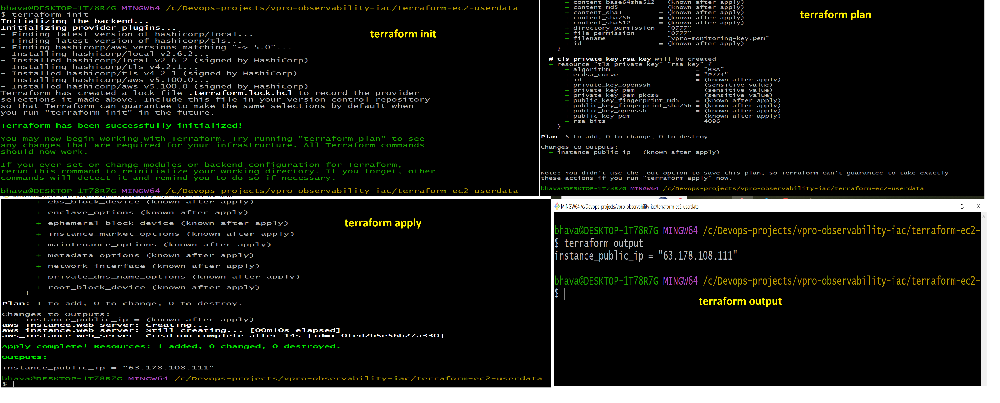
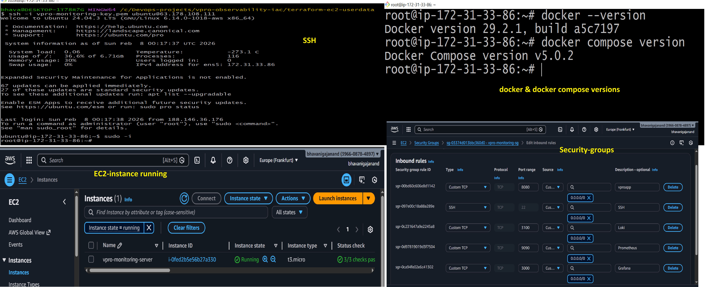
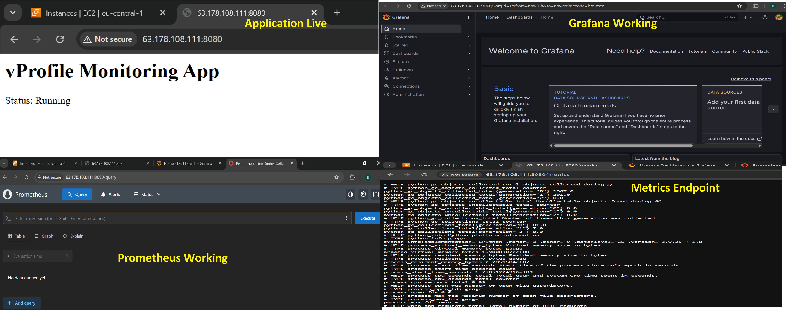
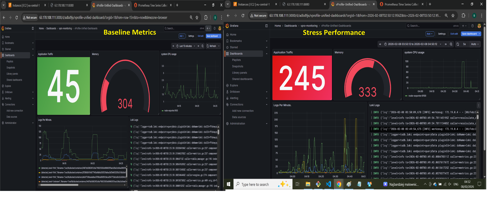

# 🚀 Full-Stack Observability on AWS with Terraform, Docker, Prometheus, Grafana & Loki

This project demonstrates a complete **end-to-end DevOps / SRE observability setup** on AWS using **Infrastructure as Code (Terraform)** and a **containerized monitoring stack**. It provides real-time metrics and log visualization for a Python application running on **EC2** in **Frankfurt (eu-central-1)**.

---

## 🧱 Architecture Overview

**Terraform provisions:**
- EC2 instance in **eu-central-1**
- Security Groups (SSH, Grafana, Prometheus, Loki, Python App)
- User Data script (`userdata.sh`) to install **Docker & Docker Compose**

**On EC2 boot:**
- Docker and Docker Compose installed automatically
- Docker Compose launches:
  - **Grafana** → dashboards & visualization
  - **Prometheus** → metrics collection
  - **Loki** → log aggregation
  - **Promtail** → log shipping
  - **Python App** → sample workload

**Load generation:**
- Produces CPU & application metrics
- Generates logs
- Visualized in Grafana dashboards

---

## 🛠️ Tech Stack

| Layer        | Technology                          |
|-------------|-------------------------------------|
| Cloud        | AWS EC2 (eu-central-1 / Frankfurt) |
| IaC          | Terraform                           |
| OS           | Ubuntu (EC2)                        |
| Containers   | Docker, Docker Compose              |
| Monitoring   | Prometheus                          |
| Visualization| Grafana                             |
| Logging      | Loki, Promtail                      |
| Application  | Python (containerized)              |

---

## 📸 Screenshots

---

## 📊 Observability Features

- Metrics scraping with **Prometheus**
- Dashboards in **Grafana**
- Centralized logging with **Loki**
- Log shipping with **Promtail**
- Real-time monitoring of live workloads

---

## 🎯 Key Demonstrations

- Provisioning cloud infrastructure with **Terraform**
- Automated EC2 bootstrapping using **User Data**
- Running a full observability stack via **Docker Compose**
- Monitoring system & application metrics
- Centralized log aggregation
- Integrating **Cloud + Containers + Observability**

---

## 📌 Future Improvements

- Add **Alertmanager** for alerts
- Implement **Auto Scaling Group** + Load Balancer
- Enable **HTTPS** via Nginx / Traefik
- Integrate **CI/CD** (GitHub Actions)
- Use **S3 + DynamoDB** for Terraform remote state
- Add authentication to Grafana
- Build advanced dashboards

---

## 👤 Author

**Bhavani Gajanand**  
GitHub: [https://github.com/bhavanigajanand](https://github.com/bhavanigajanand)

